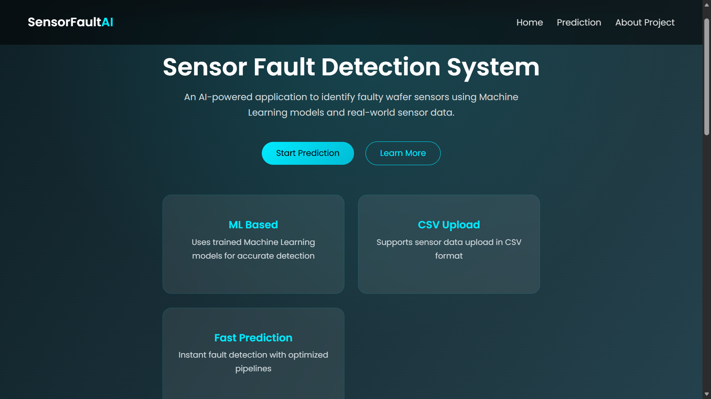
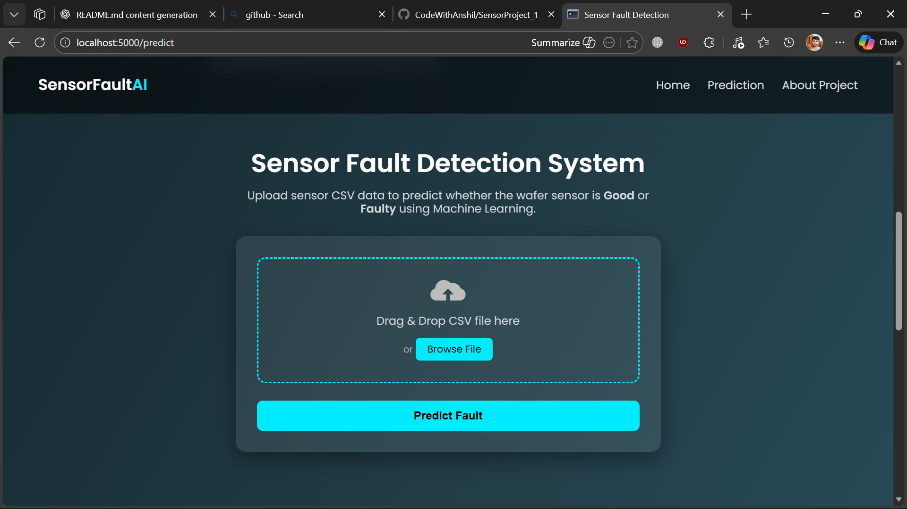
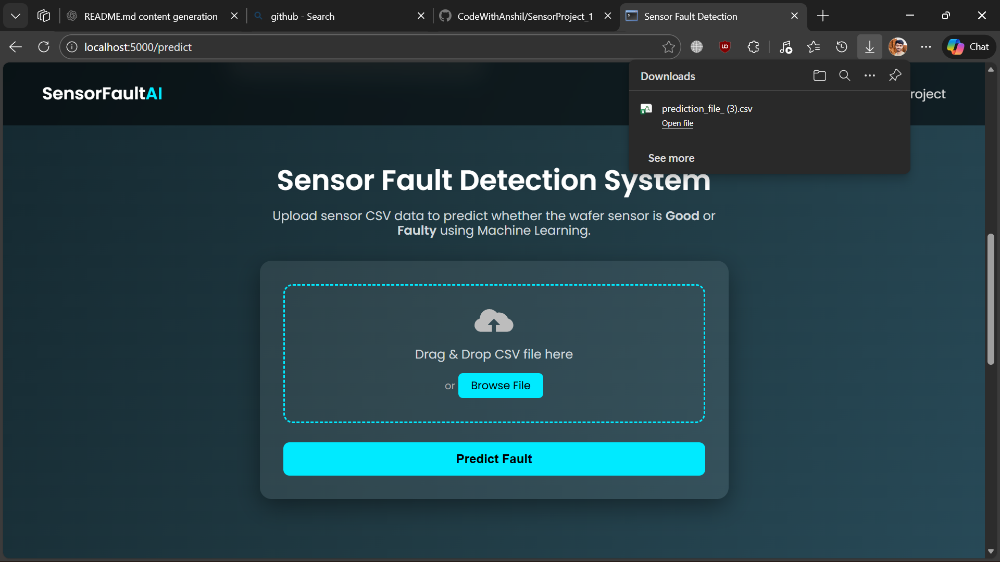
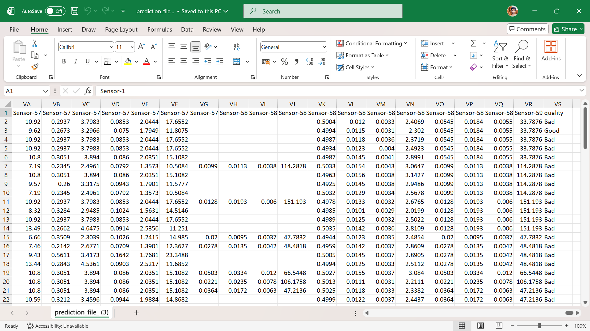

# 🚀 Sensor Fault Detection System

A complete **Machine Learning–based Sensor Fault Detection** project designed to identify faulty and non-faulty sensor readings using structured pipelines, logging, configuration files, and a web interface.

This project follows **industry-level project architecture** with modular code, configuration-driven workflows, Docker support, and prediction artifacts.

---

## 📌 Project Overview

Sensor Fault Detection helps in identifying whether a sensor reading is **Good** or **Bad** based on input data (CSV files).

### Key Features:
- Data ingestion & validation
- Model training & evaluation
- Prediction pipeline
- Logging & exception handling
- Web interface for file upload
- Dockerized deployment

---

## 🗂️ Project Structure

```text
SENSORPROJECT
│
├── .github/workflows        # CI/CD workflows
├── artifact / artifacts     # Training & model artifacts
├── config
│   └── model.yaml           # Model & pipeline configuration
├── logs                     # Application logs
├── notebooks
│   └── wafer_23012020_041211.csv
├── prediction_artifacts
│   └── test.csv
├── predictions
│   └── prediction_file_.csv
├── src
│   ├── components           # ML pipeline components
│   ├── constant             # Constant values
│   ├── pipeline             # Training & prediction pipelines
│   ├── util                 # Utility functions
│   ├── exception.py         # Custom exception handling
│   ├── logger.py            # Logging configuration
│   └── __init__.py
├── static/CSS
│   └── style.css            # Frontend styling
├── templates                # HTML templates
├── app.py                   # Flask application
├── upload_data.py           # Data upload utility
├── Dockerfile               # Docker configuration
├── requirement.txt          # Dependencies
├── setup.py                 # Package setup
├── README.md                # Project documentation
└── .gitignore

```
## ⚙️ Tech Stack
- Programming Language: Python
- Machine Learning: Scikit-learn
- Web Framework: Flask
- Data Handling: Pandas, NumPy
- Logging: Custom Logger
- Configuration: YAML
- Deployment: Docker
- Version Control: Git & GitHub
## 🔁 ML Pipeline Workflow
- Data Ingestion
- Data Validation
- Data Transformation
- Model Training
- Model Evaluation
- Prediction Generation
- Result Storage
## 🌐 Web Application Features
- Upload CSV files
- Run prediction pipeline
- Download prediction results
- User-friendly UI
## 🐳 Docker Support
**Build Docker image:**
```text
  docker build -t sensor-fault-detection .
```
**Run container:**
```
 docker run -p 5000:5000 sensor-fault-detection 
```

## ▶️ How to Run Locally
### 1️⃣ Clone Repository
```
git clone https://github.com/CodeWithAnshil/SensorProject_1.git
cd sensor-fault-detection
```
### 2️⃣ Create Virtual Environment
```
python -m venv venv
source venv/bin/activate   # Linux/Mac
venv\Scripts\activate      # Windows
```
### 3️⃣ Install Dependencies
```
pip install -r requirement.txt
````

### 4️⃣ Run Application
```
python app.py
```

## 📊 Input & Output
- **Input:** CSV file containing sensor data
- **Output:** CSV file with prediction results (Good / Bad)
## 📌 Configuration
**All model and pipeline configurations are managed via:**
```
 config/model.yaml
```

## 🧠 Key Highlights
- Modular & scalable architecture
- Production-ready ML pipeline
- Centralized logging & exception handling
- Config-driven workflow
- Dockerized deployment

## 🙌 Author
**Anshil Maurya**
Machine Learning & AI Enthusiast

## 📸 Screenshots

### Web Application Interface




### Prediction Output


